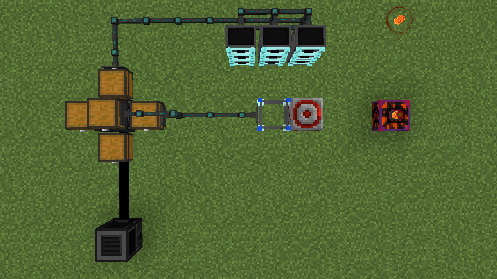

# FusionCrafter
FusionCrafter is a OpenComputers program for Draconic Evolution Fusion Crafting automation!

# Quick start

Set up a **Transposer** with five inventories connected to it and set up some pipes as follows:

* One piping items from one chest into the *Crafting Injectors*.
* One piping items from another chest into the *Fusion Crafting Core*.
* One piping items from the *Fusion Crafting Core* into another unused chest.

Now download the program and a fitting config version for your modpack:

```shell
wget https://github.com/sedlak477/fusioncrafter/blob/master/fusioncrafter.lua
wget https://github.com/sedlak477/fusioncrafter/blob/master/<VERSION>-config.lua
```

Tweak the inventories which interface with the transposer in the config and start `fusioncrafter.lua`.

> You can add `fusioncrafter.lua` to the autostart so you don't have to start it everytime you reboot.

Done! Happy crafting!

# Tutorial

You'll need the following things:

* Computer (any tier)  - This will be the computer managing the crafting
  * CPU or APU (any tier)
  * Graphics Card (any tier, only if you are using a CPU)
  * Memory (at least one tier 1.5)
  * Hard Disk (any tier)
  * EEPROM (Lua BIOS)
* Second computer for setting up the crafting computer
* Transposer
* Screen (any tier)
* OpenOS Floppy
* Cables (optional)
* 5 Chests (or any similar inventory)
* Redstone clock (any will do, even vanilla)
* Fusion Crafting setup, obviously

## Building the system

First make sure your *Infusion Crafting* is set up and working correctly. Also make sure you have the upgraded *Crafting Injectors* if you want to craft more advanced recipes.

Before we get started make sure your *Crafting Injectors* are all in **Single Item Mode**. You can change modes by shift right clicking the *Crafting Injectors* with an empty hand.

> If this feature isn't available in your version you need the find a way to place only one item into each *Crafting Injector*. You could try Ender IO *Item Conduits* in round robin mode.

* Place down the **Computer**.
  * Add your components (CPU, Memory, ...).
  * Connect the **Screen**.
  * Supply it with power.
* Place down the **Transposer** keeping in mind that you'll need access to all six of its sides.
* Place a chest (or any inventory) on 5 of its sides.
* Connect the remaining side to the crafting computer.
* Set up the pipes, which chest you choose for the following steps is completly up to you.
  * One piping items from one chest into the *Crafting Injectors*.
  * One piping items from another chest into the *Fusion Crafting Core*.
  * One piping items from the *Fusion Crafting Core* into another unused chest.
* Connect the **Redstone clock** to the *Fusion Crafting Core*.

Once you're done it should look something like this:



## Setting up the software

We're finished setting up the hardware, now it's time for the software!

First we will set up the **Hard Disk** for the crafting computer.

Insert it into another computer and install *OpenOS* onto it. You can do this by inserting an **OpenOS Floppy** and running:

```shell
install
```

> If you have multiple hard disks it will ask on which it should install. You can see which is which by hovering over the hard disk item, it will display the hard disks ID which you can select in the installation.

If you are done, reboot into the fresh *OpenOS* installation.

Now download the latest version of the program with this command:

```shell
wget https://github.com/sedlak477/fusioncrafter/blob/master/fusioncrafter.lua
```

You'll also need a config file which contains all the crafting recipes and configuration. You can download a preset and change it to your liking:

> Replace `<VERSION>` with the version you want. You can see all the versions by browsing the files in the repository.

```shell
wget https://github.com/sedlak477/fusioncrafter/blob/master/<VERSION>-config.lua
```

Rename the file to `config.lua`:

```shell
mv <VERSION>-config.lua config.lua
```

Depending on which version you downloaded, you only need the change the sides for the **Transposer** and you're done.

Open `config.lua` for editing:

```
edit config.lua
```

Now go to the part where it says `config.inventories = { ... }` and change the numbers according to your setup. Each number represents a direction the inventory is adjacent to the *Transposer*.

> Side numbers:
> * 0: down
> * 1: up
> * 2: north
> * 3: south
> * 4: west
> * 5: east

Save and quit with `Ctrl + S` and `Ctrl + W`.

Now we are nearly done, just add the `fusioncrafter.lua` to the autostart. We do this by editing `.shrc`:

```shell
edit .shrc
```

And add the following line to its end:

```shell
fusioncrafter.lua
```

Done! Pop the **Hard Disk** into the crafting computer and never worry about it again.

# Versions
Currently the is only version but contributions are always welcome! :smile:

* **atm3r**: Contains nearly all<sup>1</sup> crafting recipes for [All the Mods 3: Remix](https://www.curseforge.com/minecraft/modpacks/all-the-mods-3-remix) modpack.

<sup>1</sup> It doesn't contain the recipe for *Reactor Stabilizers* and *Chaotic Cores*.

# TODO

* Add automated system for upgrading armor and tools.
* Add support for item metadata. (Fix recipes like *Reactor Stabilizer*)
* Ore dictionary support.
* Support same item in *Crafting Injectors* and *Fusion Core* for recipes.